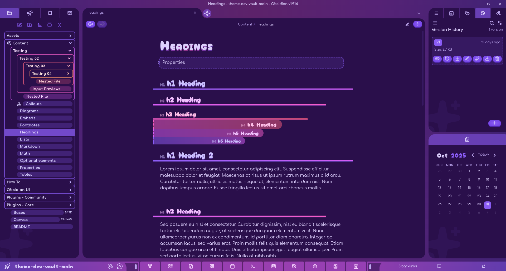

# Candy Cosmos
"Candy Cosmos" is my first ever theme for Obsidian, the result of a few months of countless reiterating over the CSS until I had something that catered to my aesthetics: bubbly UI with a both dark and vibrant palette with enough flexibility in colors to cater to a broader audience.

The primary feature of the theme is its dynamic color scheme, based on the user's own selected color accent for Obsidian. Almost every single color is affected by or derived from the accent, giving a broad range of customization without any need for plugins.

Mobile viewports are supported along with usage as a light or dark theme. However, keep in mind that the theme's dynamic color scheme and user freedom means that not every accent you choose will look appealing.

Currently, this theme will likely not see much *serious* alteration in design: I'm satisfied enough to use it personally and my motivation is fleeting at best. However, I will likely make (irregular) updates regarding bug fixes and plugin compatibility. Feel free to pull from and modify this theme yourself, however, as it's under an [MIT license](https://choosealicense.com/licenses/mit/)!
## Features
Besides the most notable feature of a dynamic color scheme, Candy Cosmos has other distinctive features such as:
- A Bottom-Positioned Ribbon + Side-dock Collapse Buttons (Desktop)
- Colored **Bold** and *Italic* Text
- Visually Distinct Headings + Heading Number Indicators
- Unique File Folders w/Nesting-Based Coloration
- Elements Inside Colored Containers (Callouts, Canvas Nodes, Tables) Inherit Colors
## Installation
Until the theme is approved for the theme store, there are two methods for installation.
### Manual
1. Download and extract the folder for the latest release.
2. Cut and paste the folder into the theme directory of your Obsidian vault at `vault-dir/.obsidian/themes/`.
3. Make sure the folder is named "Candy Cosmos." Obsidian will not recognize the theme if the folder name does not match the name provided in the `manifest.json`.
### BRAT
1. Install the [BRAT](https://github.com/TfTHacker/obsidian42-brat) plugin.
2. Go to the plugin's options/settings page in the Obsidian menu under "Community Plugins."
3. Select "Add beta theme," copy-paste the theme's repository link, then select "Add theme."
## Compatibility
The unique buttons and transparent elements of the theme can result in plugins that look distinctly off. With this in mind, a list has been made of compatible plugins, including whether they're being actively patched or are supported out of the box. Being only one person, I won't be able to patch every plugin, but, if it's requested, I'll try to make an effort.

Patched Plugins
- [Calendar](https://github.com/liamcain/obsidian-calendar-plugin)
- [Calendarium](https://github.com/javalent/calendarium)
- [Dice Roller](https://github.com/javalent/dice-roller)
- [Editing Toolbar](https://github.com/PKM-er/obsidian-editing-toolbar)
- [Fantasy Statblocks](https://github.com/javalent/fantasy-statblocks)
- [Iconic](https://github.com/gfxholo/iconic)
- [Kanban](https://github.com/mgmeyers/obsidian-kanban)
- [Longform](https://github.com/kevboh/longform)
- [Version Control](https://github.com/Yuichi-Aragi/Version-Control)
## Style Settings
[Style Settings](https://github.com/mgmeyers/obsidian-style-settings) integration is planned for an eventual future release, majorly for adjusting how colors are applied in minor ways. Suggestions for what features to add to the Style Settings menu can be directed towards the theme's dedicated forum post in the Obsidian Discord server's `#notes-showcase/"Candy Cosmos" Theme (WIP)` or by shooting me an email.
## Known Issues
- Minor animation errors are present on the sidebar collapse indicators when opened or closed.
- Dragging to reposition ribbon buttons is no longer functional.